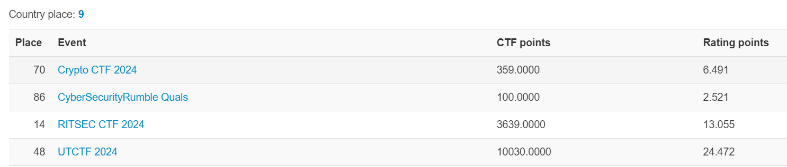

# I'm in the CRYPTO TOP10

## 서론
작년 여름방학에 해킹대회 나가는 친구들이 멋져서 나도 CTF에 입문했었다. 
크립토는 아무도 안하길래 블루오션 개꿀 하면서 선택했는데, 만만한 곳이 아니었다(~~그때 도망쳤어야 했는데~~). 
솔직히 처음엔 1레벨도 너도 어려워서 진짜 할 거 없을 때 가끔씩 풀었다. 
근데 어쩌다 나가게 된 대회에서 처참히 노솔, 공부의 압박이 겹쳐 10월 말 부터 아예 안하게 되었다. 

그러다 겨울방학에 친구들과 online CTF 몇 개를 참여하며 다시 흥미를 가지게 되었고, Cryptohack도 풀면서 실력이 늘기 시작했다. 

개학 후 참여한 online CTF들에서 좋은 성적을 거두며 ctftime 한국 9등까지 달성하였고, 
Dreamhack wargame도 고레벨 문제 몇 개를 풀면서 coppersmith, LLL과 같은 테크닉을 배우고, 점수도 올라가기 시작했다. 

최근에 참여한 CryptoCTF는 혼자서 70등을 달성하며 만족스러운 결과를 얻었고(~~71등이 PPP다~~), 
Codegate2024는 Crypto문제를 풀진 못했지만 어려운 문제를 95%정도 풀었다는 점에 실력의 향상을 느꼈다. 

그리고 1학기 기말고사까지 끝났겠다, wargame을 달리기 시작했고, 4천점을 넘어 4923점, **10등**이 되었다.

## 목표
아직 8레벨에 약간 날먹 문제가 2개 있다. 공부하다 지쳤을 때 가끔씩 풀어서 방학 전까지 이 둘을 풀고(하나당 500점 준다), 5위에 안착하겠다. 이건 소망이지만, 2024년이 지나기 전에, 9레벨 하나 풀고 2등을 달성하겠다.

### 읽어주셔서 감사합니다!
