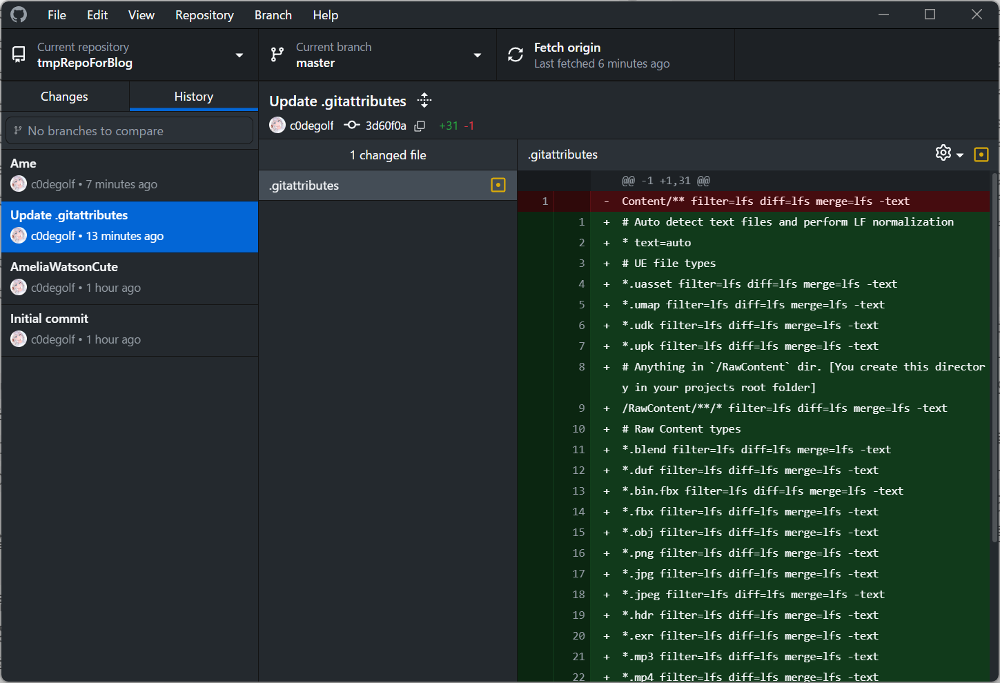
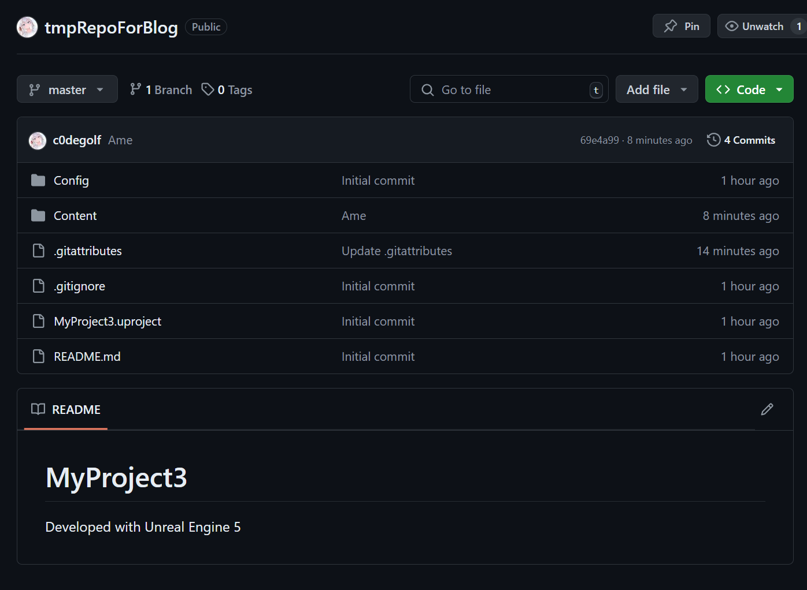
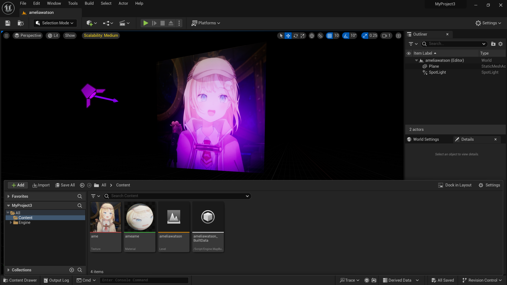

# 서론
동아리에서 게임을 같이 만들다 보면 서로 개발한 부분을 공유할 필요가 있다.<br>
그렇다고 USB에 각자 담아서 옮길 순 없으니 대 황 깃허브를 사용한다. 빠르게 알아보자

## Git 설치
[Git](https://git-scm.com/download/win)에서 64bit installer를 설치한다. 자세한건 [여기](https://sfida.tistory.com/46)참고 (Git installer 설치 중 LFS 설치는 꼭 체크해주자)<br>
설치가 완료되었다면 `Git Bash`실행 후 기본 설정을 해준다.
```bash
git config --global user.name "Github ID"
git config --global user.email Github email
```
다 되면 exit 해준다.

## Github Dektop 설치
[Github Desktop](https://desktop.github.com/download/)에서 설치한다. 설치가 완료되었으면 그냥 냅두면 된다.

## 레포지토리 생성
Github에서 레포 하나를 생성해준다. 그 후 깃허브에 업로드하고자 하는 언리얼 프로젝트를 연다.

## 레포지토리 연결
`Edit > Plugins`에서 git이 활성화 되어있는지 확인한다.<br>
프로젝트 우측 하단에 `Revision Control > Provider: Git (beta version)`을 선택하면 Git을 자동인식하고 설정한 ID와 email이 보일 것이다.<br>
+ `URL of the remote server`: 레포의 `.git`주소를 입력한다. `https://github.com/사용자명/레포명.git`이런 형식이다.
+ `Add a .gitignore file`: 언리얼이 쓸데없는 파일 거르고 업로드해준다. **필수로 체크한다**
+ `Add a .gitattributes file to enable Git LFS`: 대용량 파일 업로드 필요시 체크한다.<br>
  
다 되었다면 `Initialize project with Git`을 눌러 설정을 마친다.

`Add a .gitattributes file to enable Git LFS`을 체크한 경우 언리얼 프로젝트 폴더를 보면 `.gitattributes`란 파일이 생성되었을 텐데, 아래의 내용으로 바꿔준다.
```
# Auto detect text files and perform LF normalization
* text=auto

# UE file types
*.uasset filter=lfs diff=lfs merge=lfs -text
*.umap filter=lfs diff=lfs merge=lfs -text
*.udk filter=lfs diff=lfs merge=lfs -text
*.upk filter=lfs diff=lfs merge=lfs -text

# Anything in `/RawContent` dir. [You create this directory in your projects root folder]
/RawContent/**/* filter=lfs diff=lfs merge=lfs -text

# Raw Content types
*.blend filter=lfs diff=lfs merge=lfs -text
*.duf filter=lfs diff=lfs merge=lfs -text
*.bin.fbx filter=lfs diff=lfs merge=lfs -text
*.fbx filter=lfs diff=lfs merge=lfs -text
*.obj filter=lfs diff=lfs merge=lfs -text
*.png filter=lfs diff=lfs merge=lfs -text
*.jpg filter=lfs diff=lfs merge=lfs -text
*.jpeg filter=lfs diff=lfs merge=lfs -text
*.hdr filter=lfs diff=lfs merge=lfs -text
*.exr filter=lfs diff=lfs merge=lfs -text
*.mp3 filter=lfs diff=lfs merge=lfs -text
*.mp4 filter=lfs diff=lfs merge=lfs -text
*.mov filter=lfs diff=lfs merge=lfs -text
*.wav filter=lfs diff=lfs merge=lfs -text
*.3ds filter=lfs diff=lfs merge=lfs -text
*.psd filter=lfs diff=lfs merge=lfs -text
*.mb filter=lfs diff=lfs merge=lfs -text
*.tga filter=lfs diff=lfs merge=lfs -text
*.cubemap filter=lfs diff=lfs merge=lfs -text
*.tif filter=lfs diff=lfs merge=lfs -text
*.xcf filter=lfs diff=lfs merge=lfs -text
```
이제 `Github Desktop`을 실행하고, `Add exisiting repository`에서 언리얼 프로젝트 폴더를 선택한다.<br>
`Add a .gitattributes file to enable Git LFS`에 체크했다면 `Initialize Git LFS` 팝업이 뜨는데, `Initialize Git LFS`를 눌러준다.<br>
그 후 `Changes`탭에서 `.gitattributes`의 변경사항을 커밋해준다.


다시 언리얼 프로젝트로 돌아와 아무 블루프린트 클래스나 하나 만들고, `Revision Control > Submit Content`에서 커밋한다.<br>
`Github Desktop`해당 레포에서 `History`탭에 들어가면 커밋 내역이 뜰 것이다.<br>
이제 상단의 `Push origin`을 눌러 원격 저장소에 업로드해주면 끝이다.<br>
다른 사용자와 `pull / fetch`를 통해 파일을 지속적으로 공유할 수 있다.


잘 연동된 것을 볼 수 있다.

## 레포 불러오기 & 변경사항 패치
아까 커밋한 레포를 클론해 실행해보면, 

보이듯이 잘 불러와진 모습을 볼 수 있다.

또한 다른 사람이 작업한 변경사항을 동기화하려면, `Github Desktop`에서 상단의 `Repository > Pull`해주면 된다.

## 팁
+ 여러 브랜치를 만들고 작업할 경우, `Github Desktop`에서 내가 커밋할 브랜치로 변경 후, 언리얼에서 `Submit Content`하면 그 브랜치로 커밋된다.
+ 특정 브랜치만 가져올 경우 `git clone -b BRANCH_NAME --single-branch REMOTE_URL`을 통해 불러올 수 있다.
+ 만일 어떤 과정 진행중 오류가 발생한다면 **언리얼, Git 관련 프로그램을 모두 종료한 후**, `PROJECT_PATH/.git/index` 파일을 삭제하고 다시 `Submit Content`해보자
+ Git LFS는 무료 요금제 기준 용량, 대역폭이 1GB 고정이므로 100MB정도 되는 파일은 `.gitignore`에 추가 후, Google Drive, USB 등등 다른 방법으로 공유해야한다 (수시로 확인해 돈이 빠져나가는 일이 없게 하자).
+ Unreal C++ 사용시 pull 후 `.uproject 우클릭 > Generate Visual Studio project files`로 Regenerate 하고, `.sln`을 통해 에디터를 켜야한다.

### 읽어주셔서 감사합니다!
